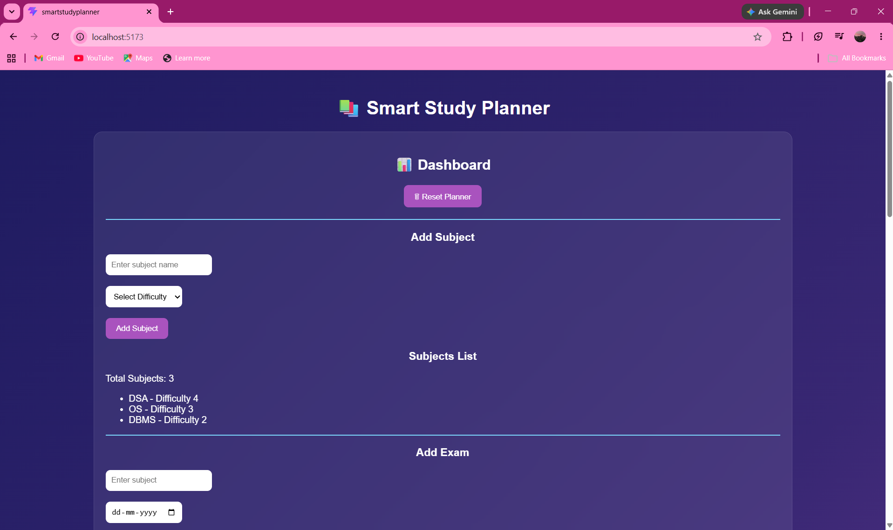
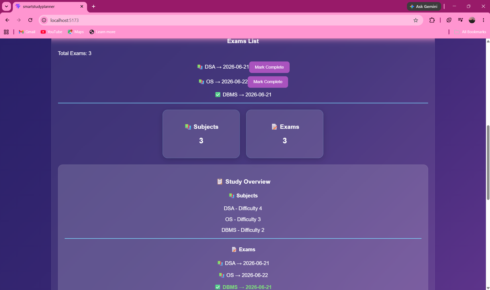
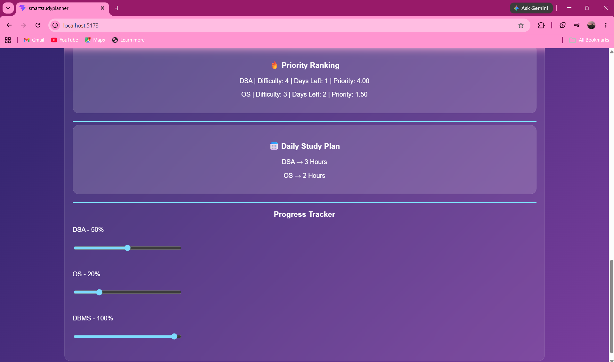

# 📚 Smart Study Planner

## 📖 About the Project

Smart Study Planner is a React-based productivity application designed to help students organize their studies efficiently. Users can add subjects, set difficulty levels, track exams, monitor study progress, and automatically generate priority-based study plans.

The application uses browser localStorage to persist data, ensuring that study information remains available even after refreshing or closing the browser.

---

## ✨ Features

* Add subjects with difficulty levels
* Add exam dates
* Priority ranking based on difficulty and days remaining
* Daily study plan generation
* Progress tracking using sliders
* Mark exams as completed
* Local storage persistence
* Dashboard statistics
* Northern Lights inspired UI

---

## 🎯 Project Highlights

* Automatically calculates exam priority
* Generates study plans based on urgency
* Tracks learning progress visually
* Stores data using browser localStorage
* Allows marking exams as completed

---

## 🛠️ Tech Stack

* React.js
* JavaScript (ES6)
* CSS3
* Local Storage API
* Vite

---

## 📸 Screenshots

### Home Dashboard



### Study Overview & Dashboard Statistics



### Priority Ranking & Progress Tracking



---

## 🚀 Installation

Clone the repository:

```bash
git clone https://github.com/Nanditacodes29/SmartStudyPlanner.git
```

Go to project folder:

```bash
cd SmartStudyPlanner
```

Install dependencies:

```bash
npm install
```

Run the project:

```bash
npm run dev
```

---

## 📊 Priority Formula

Priority = Difficulty / Days Left

Subjects with higher difficulty and fewer days remaining receive higher study priority.

---

## 📈 Future Improvements

* Firebase Authentication
* Cloud Database Storage
* AI-generated Study Plans
* Notifications and Reminders
* Mobile Responsive Design

---

## 👩‍💻 Author

Nandita Gaur

B.Tech CSE (Blockchain Technology)

VIT Vellore
